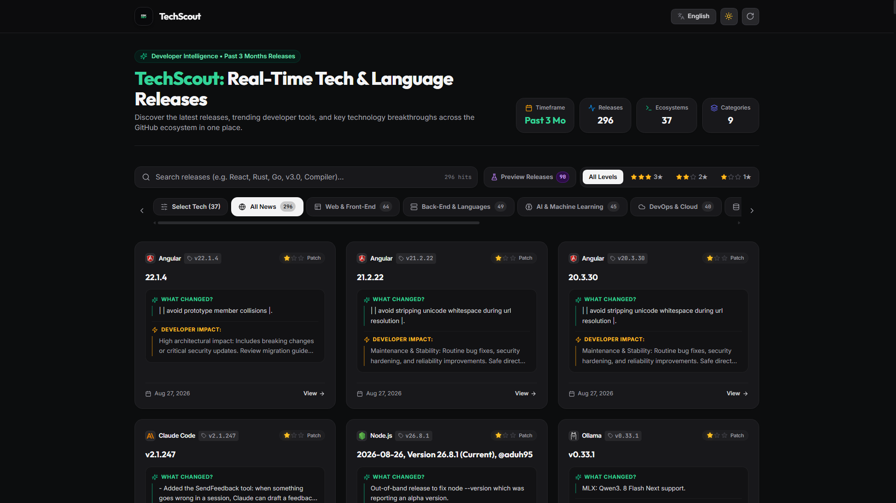
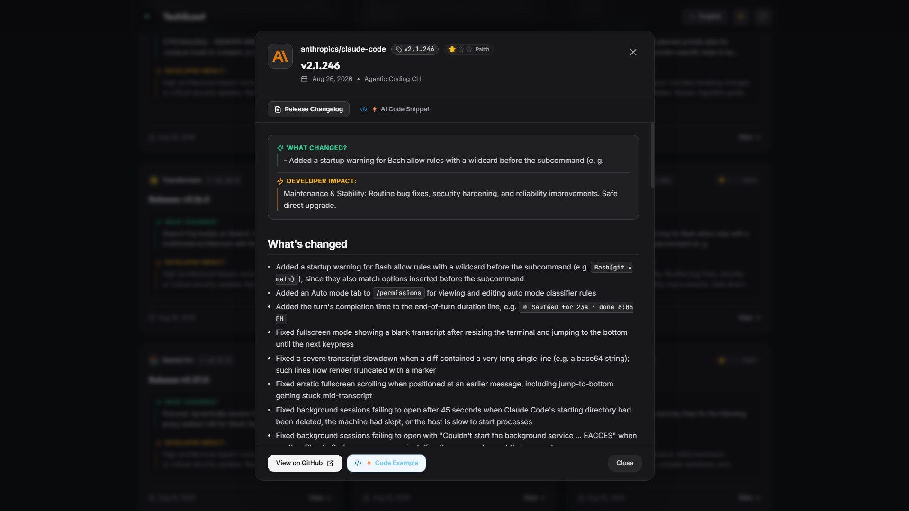

# TechScout

TechScout is a React and TypeScript dashboard for following recent releases from popular software projects. It fetches public release data from GitHub and organizes it by ecosystem.

> Türkçe dokümantasyon için [aşağıya geçin](#türkçe).

## Screenshots

### Release dashboard



### Release details



## Features

- Releases published during the last 90 days
- Stable and pre-release filtering
- Category, technology, importance, and keyword filters
- English and Turkish interface
- Light and dark themes
- Five-minute browser cache for release data

## Requirements

- Node.js 18 or newer
- npm

## Quick start

```bash
git clone https://github.com/efeberkkilic/TechScout.git
cd TechScout
npm install
npm run dev
```

Open the URL printed by Vite, normally <http://localhost:5173>.

The application is intentionally credential-free and uses GitHub's unauthenticated public API limits.

## Commands

```bash
npm run dev      # Start the development server
npm run build    # Type-check and create a production build
npm run preview  # Preview the production build locally
```

## Public deployment and security

The frontend does not accept API keys or tokens. It only calls GitHub's unauthenticated public API, so a production build cannot accidentally embed project credentials.

If authenticated GitHub access or AI features are added later, route those requests through a backend or serverless endpoint. Store credentials only in the server-side environment and add authentication and rate limiting before exposing the endpoint.

## Project structure

```text
src/
  components/   UI components
  config/       Repository and API endpoint configuration
  context/      Language and theme state
  services/     Public GitHub API client
  types/        TypeScript types
  utils/        Date and Markdown helpers
public/         Static assets
```

## Data and privacy

Release data is cached in the browser's `localStorage`. The project does not send user data to its own server.

## License

This project is licensed under the MIT License. See [LICENSE](LICENSE) for details
---

## Türkçe

TechScout, popüler yazılım projelerinin güncel sürümlerini takip etmeyi sağlayan React ve TypeScript tabanlı bir geliştirici panosudur. Public sürüm verilerini GitHub'dan alır ve ekosistemlere göre düzenler.

## Özellikler

- Son 90 günde yayımlanan sürümler
- Kararlı ve önizleme sürümü filtreleri
- Kategori, teknoloji, önem seviyesi ve anahtar kelime filtreleri
- Türkçe ve İngilizce arayüz
- Açık ve koyu tema
- Sürüm verileri için beş dakikalık tarayıcı önbelleği

## Gereksinimler

- Node.js 18 veya üzeri
- npm

## Hızlı başlangıç

```bash
git clone https://github.com/efeberkkilic/TechScout.git
cd TechScout
npm install
npm run dev
```

Vite'ın terminalde gösterdiği adresi açın; bu adres normalde <http://localhost:5173> olur.

Uygulama bilinçli olarak hiçbir kimlik bilgisi kullanmaz ve GitHub'ın kimlik doğrulamasız public API limitleriyle çalışır.

## Komutlar

```bash
npm run dev      # Geliştirme sunucusunu başlatır
npm run build    # Tip kontrolü yapar ve production çıktısı oluşturur
npm run preview  # Production çıktısını yerelde önizler
```

## Public yayın ve güvenlik

Frontend API anahtarı veya token kabul etmez. Yalnızca GitHub'ın kimlik doğrulamasız public API'sini çağırdığı için production derlemesine yanlışlıkla proje kimlik bilgisi gömülemez.

İleride kimlik doğrulamalı GitHub erişimi veya yapay zekâ özellikleri eklenirse bu istekleri bir backend ya da serverless endpoint arkasına taşıyın. Anahtarları yalnızca sunucu ortamında saklayın; endpoint'e kimlik doğrulama ve istek sınırlaması ekleyin.

## Proje yapısı

```text
src/
  components/   Arayüz bileşenleri
  config/       Repository ve API endpoint yapılandırması
  context/      Dil ve tema durumu
  services/     Public GitHub API istemcisi
  types/        TypeScript tipleri
  utils/        Tarih ve Markdown yardımcıları
public/         Statik dosyalar
```

## Veri ve gizlilik

Sürüm verileri tarayıcının `localStorage` alanında önbelleğe alınır. Proje kendi sunucusuna kullanıcı verisi göndermez.

## Lisans

Bu proje MIT Lisansı ile lisanslanmıştır. Ayrıntılar için [LICENSE](LICENSE) dosyasına bakın.
